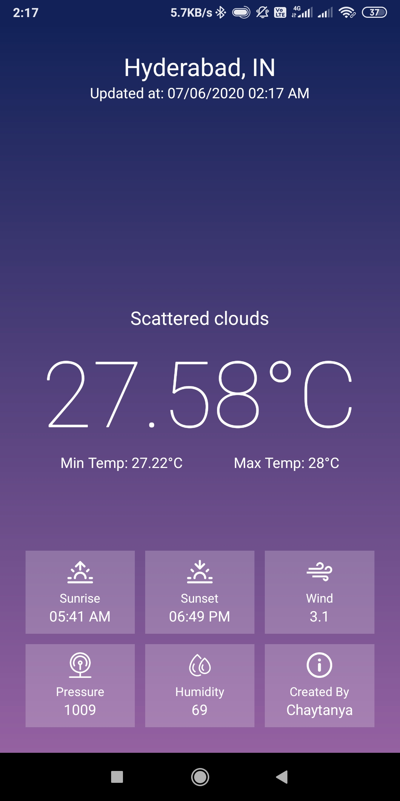

### Weather_App
 

This project is an Android Weather App using Kotlin.
To get the weather information I used <a href="https://openweathermap.org" target="_blank">OpenWeatherMap</a> API. 
Informations like Temperature, Pressure, Humidity, Weather status, Time of Sunrise and Sunset etc. are passed from the geographical dependent weather API.

 

